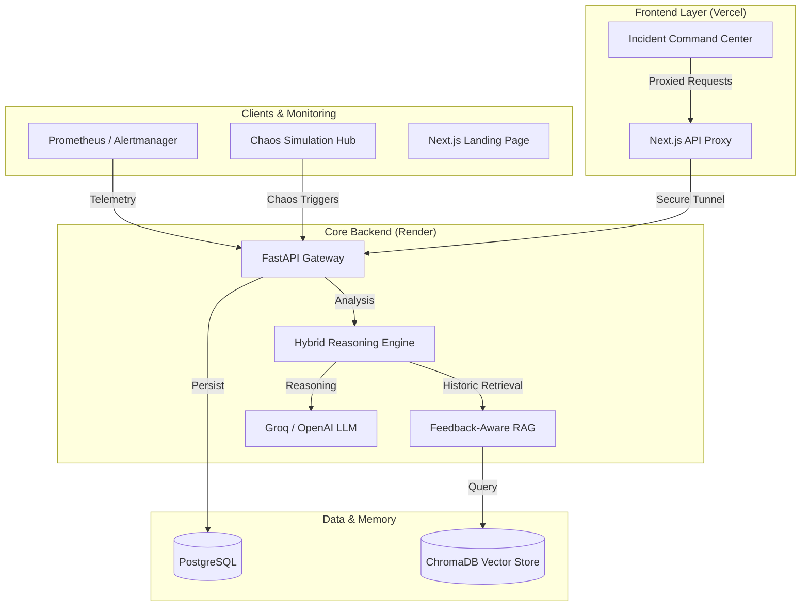

# Sentinel-SRE 🛡️
### AI-Powered Root Cause Analysis for Modern Infrastructure

[](https://nextjs.org/)
[](https://fastapi.tiangolo.com/)
[](https://www.trychroma.com/)
[](https://opensource.org/licenses/MIT)

**Sentinel-SRE** is a next-generation incident management platform designed to transform how engineering teams handle system failures. By unifying deterministic SRE rules with real-time statistical anomaly detection and a feedback-aware RAG (Retrieval-Augmented Generation) pipeline, Sentinel-SRE doesn't just monitor—it reasons.

---

## 🏗️ System Architecture



---

## 🚀 Key Features

### 1. Hybrid Reasoning Engine
Layers three distinct analysis phases:
*   **Safety Rule Matching**: Immediate identification of high-confidence failure signatures (e.g., OOM, CPU Saturation).
*   **Statistical Anomaly Scoring**: Real-time z-score analysis to find deviations in service signals.
*   **Contextual GPT Synthesis**: High-level root cause hypotheses including immediate mitigation steps.

### 2. Feedback-Aware RAG Learning
The AI learns from your engineers. When an engineer upvotes or downvotes a hypothesis, that signal is embedded back into the **ChromaDB** vector store. The system automatically weights verified historic incidents higher in future retrievals.

### 3. Service Dependency Mapping
Interactive SVG-based visualization of your infrastructure. It automatically calculates **Blast Radius** and shows how an incident in one service propagates to downstream dependencies.

### 4. Interactive Chaos Lab
Built-in resilience testing environment. Trigger simulated memory leaks, database connection failures, and network latency spikes to test your team's response and the AI's detection capability.

---

## 🛠️ Technology Stack

*   **Frontend**: Next.js 14, Tailwind CSS, Framer Motion, Lucide Icons.
*   **Backend**: Python 3.10+, FastAPI, Gunicorn/Uvicorn.
*   **Intelligence**: LlamaIndex, OpenAI/Groq (LLMs), OpenAI Embeddings (API-based).
*   **Storage**: PostgreSQL (Relational), ChromaDB (Vector Search).
*   **Deployment**: Vercel (Frontend), Render (Backend).

---

## 📦 Getting Started

### Prerequisites
*   Python 3.10+
*   Node.js 18+
*   OpenAI API Key (for LLM and Embeddings)
*   Groq API Key (Optional, for high-speed inference)

### Installation

1.  **Clone the repository**:
    ```bash
    git clone https://github.com/yourusername/sentinel-sre.git
    cd sentinel-sre
    ```

2.  **Setup Backend**:
    ```bash
    cd backend
    pip install -r requirements.txt
    cp .env.example .env # Add your keys
    uvicorn main:app --reload
    ```

3.  **Setup Frontend**:
    ```bash
    cd ../frontend
    npm install
    npm run dev
    ```

---

## 🌐 Production Deployment

### Backend (Render)
1. Set **Root Directory** to `backend`.
2. **Build Command**: `pip install -r requirements.txt`.
3. **Start Command**: `gunicorn -w 1 -k uvicorn.workers.UvicornWorker --bind 0.0.0.0:$PORT main:app`.
4. Set `ALLOWED_ORIGINS` to your Vercel URL.

### Frontend (Vercel)
1. Set **Root Directory** to `frontend`.
2. Add `BACKEND_URL` pointing to your Render service.
3. The app uses a built-in proxy to bypass CORS, so ensure `BACKEND_URL` matches your live Render API.

---

## 📄 License

Distributed under the MIT License. See `LICENSE` for more information.

---

Built with ⚡ for the SRE Community.
