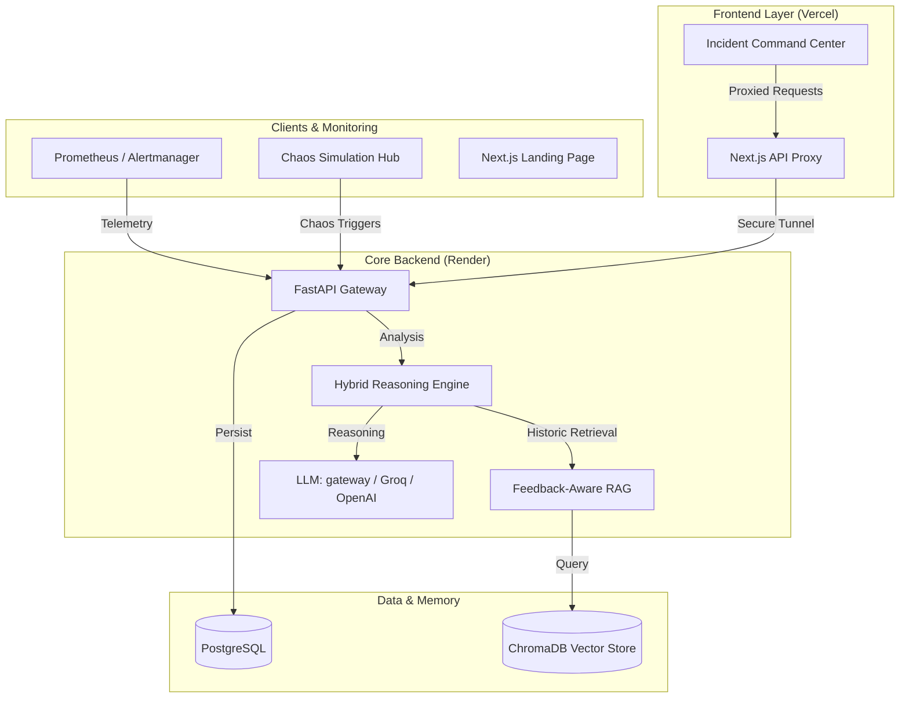

<div align="center">
  
  <h1>Sentinel-SRE</h1>
  <p><b>AI-Powered Root Cause Analysis for Modern Infrastructure</b></p>

  <p>
    
    
    
    
  </p>

  <p><b>Sentinel-SRE</b> is a next-generation incident management platform designed to transform how engineering teams handle system failures. By unifying deterministic SRE rules with real-time statistical anomaly detection and a feedback-aware RAG pipeline, Sentinel-SRE doesn't just monitor—it reasons.</p>
</div>

---

## Table of Contents

---

- [🏗️ System Architecture](#️-system-architecture)
- [🚀 Key Features](#-key-features)
- [🛠️ Technology Stack](#️-technology-stack)
- [📦 Getting Started](#-getting-started)
- [🧪 Running the Tests](#-running-the-tests)
- [🎬 Demo Walkthrough](#-demo-walkthrough)
- [🌐 Production Deployment](#-production-deployment)
- [📄 License](#-license)

---

## 🏗️ System Architecture


```mermaid
graph TD
    subgraph "Clients & Monitoring"
        PR[Prometheus / Alertmanager]
        CH[Chaos Simulation Hub]
        WEB[Next.js Landing Page]
    end

    subgraph "Frontend Layer (Vercel)"
        DASH[Incident Command Center]
        PROXY[Next.js API Proxy]
    end

    subgraph "Core Backend (Render)"
        API[FastAPI Gateway]
        HYB[Hybrid Reasoning Engine]
        RAG[Feedback-Aware RAG]
        LLM[LLM: gateway / Groq / OpenAI]
    end

    subgraph "Data & Memory"
        PG[(PostgreSQL)]
        VDB[(ChromaDB Vector Store)]
    end

    PR -- Telemetry --> API
    CH -- Chaos Triggers --> API
    API -- Analysis --> HYB
    HYB -- Historic Retrieval --> RAG
    RAG -- Query --> VDB
    API -- Persist --> PG
    HYB -- Reasoning --> LLM
    DASH -- Proxied Requests --> PROXY
    PROXY -- Secure Tunnel --> API
```

---

## 🚀 Key Features

### 1. Hybrid Reasoning Engine
Four layers run per incident, each behind its own timeout so one slow provider cannot hang the request:
*   **Deterministic Rules** — six explicit failure signatures (OOM, CPU saturation, connection-pool exhaustion, …). Rules that *almost* fired are returned as `rejected_hypotheses` with the evidence they were missing, so the reasoning is auditable.
*   **Statistical Anomaly Scoring** — z-scores against per-metric baselines; every metric is scored, and only those past the threshold are flagged.
*   **Feedback-Aware RAG** — similar past incidents from ChromaDB, split into upvoted / downvoted / unrated so the prompt can learn from both.
*   **LLM Synthesis** — writes the narrative from the layers above, via any OpenAI-compatible provider.

Hypotheses are then ranked by **source-weighted** confidence: a matched rule names a *cause*, while an anomaly usually names a *symptom* of that same cause, so equal raw scores are not treated as equal evidence (see `SOURCE_WEIGHTS` in [hybrid_analyzer.py](backend/hybrid_analyzer.py)).

### 2. Provider-Agnostic by Configuration
Completion goes over plain HTTP to `/chat/completions`, which every major provider and gateway speaks. A provider is therefore three values — key, base URL, model id — and switching to a different one is a config change, not a code change. The chain is tried in order:

1.  **Gateway** — any OpenAI-compatible endpoint (a quota marketplace, OpenRouter, LiteLLM, a self-hosted proxy). Set `LLM_GATEWAY_API_KEY`, `LLM_GATEWAY_BASE_URL` and `LLM_GATEWAY_MODEL`; all three are required, since a missing model id would 404 on every call. `LLM_GATEWAY_FALLBACK_MODELS` names next choices, which matters on a pooled gateway where one model's upstream supply can drain while others answer fine.
2.  **Groq**, then **OpenAI** — direct keys, used as fallbacks.

`GET /api/v1/diagnostics` reports `providers.llm_chain`: the exact model ids that would be tried, in order, so "why is there no narrative?" starts from fact rather than guesswork. Keys are never returned.

Timeouts are sized for a pooled gateway rather than a direct call: `LLM_TIMEOUT_SECONDS` (90s) per attempt, and `LLM_TOTAL_BUDGET_SECONDS` (150s) for the whole chain. Both come from measurement — a real narrative on the configured gateway takes a **~40s median and up to ~56s**, so the previous 20s per-attempt ceiling cut off most healthy calls and read as "every model failed".

The chain budget exists because per-attempt timeouts alone do not bound a chain: eight candidates at 90s each would outlive gunicorn's 180s request timeout and return a 502 instead of the data-only postmortem the app already has ready. Postmortem generation makes **two** chained completions in one request (analysis, then narration), so that path passes `LLM_CHAINED_BUDGET_SECONDS` — half the budget per leg. Tests assert both relationships against the real gunicorn config.

**Choosing a model.** Latency is the wrong sole criterion on a credit-billed gateway. Measured on the real analysis prompt, the fastest responder available was a flagship model costing **~25 credits per analysis**, against **~0.1–0.34** for the flash-class model actually configured — a ~100x difference for the same job. Rank candidates by cost per analysis first, discard any that omit the six sections the panel renders, and only then prefer the faster one. Fallbacks are deliberately different model families: a quota-sharing gateway drains one upstream pool at a time, so a same-family fallback tends to be unavailable in the same moment.

### 3. Degrades Instead of Failing
Every external dependency has a fallback, because they all fail in practice:
*   Providers retire model ids and exhaust quotas — unreachable models are skipped at call time and the chain moves on.
*   Embedding APIs run out of quota — a dependency-free local hashing embedding takes over (lexical, not semantic) on its own Chroma collection. Gateway embeddings are used **only** when `LLM_GATEWAY_EMBED_MODEL` is set, because most gateways proxy chat only and a wrong value fails on every indexed incident rather than once.
*   No LLM key at all — postmortems still render as a data-only document from the deterministic layers, labelled as generated without AI narration.

### 4. Feedback-Aware RAG Learning
The AI learns from your engineers. When an engineer upvotes or downvotes a hypothesis, that signal is embedded back into the **ChromaDB** vector store. The system automatically weights verified historic incidents higher in future retrievals.

### 5. Multi-Tenant by Construction
Every incident carries a `user_id`. Tenant scoping is enforced at the query layer, the RAG metadata filter, and the per-tenant Prometheus webhook token. Cross-tenant reads return **404, not 403**, so the API never confirms that another tenant's incident exists.

### 6. Service Dependency Mapping
Interactive SVG-based visualization of your infrastructure. It automatically calculates **Blast Radius** and shows how an incident in one service propagates to downstream dependencies.

### 7. Interactive Chaos Lab
Built-in resilience testing environment. Trigger simulated memory leaks, database connection failures, and network latency spikes to test your team's response and the AI's detection capability.

---

## 🛠️ Technology Stack

*   **Frontend**: Next.js 16 (App Router, Turbopack), React 18, TypeScript (strict), Tailwind CSS, Framer Motion, Lucide Icons.
*   **Backend**: Python 3.10–3.12, FastAPI, SQLModel, Uvicorn/Gunicorn, slowapi (rate limiting), PyJWT + bcrypt.
*   **Intelligence**: LlamaIndex, any OpenAI-compatible LLM provider (gateway → Groq → OpenAI, in that order), OpenAI embeddings with a local hashing fallback.
*   **Storage**: SQLite locally / PostgreSQL in production, ChromaDB (vector search).
*   **Testing**: pytest + FastAPI `TestClient` — 140 tests, fully offline.
*   **Deployment**: Vercel (Frontend), Render (Backend).

---

## 📦 Getting Started

### Prerequisites
*   Python 3.10–3.12 (3.12 is pinned for deployment; 3.13 is not supported by the pinned ChromaDB)
*   Node.js 18+
*   An API key for any **OpenAI-compatible** LLM endpoint — a gateway, Groq, or OpenAI. None is strictly required: the app runs without one and degrades to its deterministic layers.

### Installation

1.  **Clone the repository**:
    ```bash
    git clone https://github.com/yourusername/sentinel-sre.git
    cd sentinel-sre
    ```

2.  **Set up the backend**:
    ```bash
    cd backend
    python -m venv venv
    source venv/Scripts/activate      # Windows (git bash); use venv/bin/activate on macOS/Linux
    pip install -r requirements.txt
    cp .env.example .env              # then fill in the values below
    ```

    Minimum working `.env` for local development:
    ```bash
    JWT_SECRET=<python -c "import secrets; print(secrets.token_urlsafe(64))">
    ADMIN_EMAIL=admin@sentinel-sre.dev
    ADMIN_PASSWORD=<strong password: 8+ chars, upper + lower + digit>
    DATABASE_URL=sqlite:///./incidents.db

    # An OpenAI-compatible gateway — all three are required or it is skipped.
    # Use the exact model id from the gateway's own model list.
    LLM_GATEWAY_API_KEY=<your key>
    LLM_GATEWAY_BASE_URL=https://your-gateway.example.com/v1
    LLM_GATEWAY_MODEL=<model id>
    LLM_GATEWAY_FALLBACK_MODELS=<second choice>,<third choice>

    # Or, instead of (or behind) the gateway:
    GROQ_API_KEY=<your key>
    ```
    `ADMIN_EMAIL` must use a real public TLD — `.local` addresses are rejected by the login validator and the seeder will fall back to the default. If `ADMIN_PASSWORD` is unset, a random dev password is generated and printed to the log on boot.

3.  **Run the backend**:
    ```bash
    uvicorn main:app --reload --port 8000
    ```
    Watch the startup log — it reports which LLM and embedding backend resolved, seeds the admin tenant, and prints the admin webhook token **once**. To confirm the provider chain resolved the way you expect, set `DIAGNOSTICS_TOKEN` and read `providers.llm_chain` from `GET /api/v1/diagnostics`.

4.  **Run the frontend**:
    ```bash
    cd ../frontend
    npm install
    npm run dev
    ```
    Open <http://localhost:3000>. Requests to `/api/*` are proxied to `http://127.0.0.1:8000` by the Next.js rewrite, so no CORS setup is needed locally. Override the target with `BACKEND_URL` if the backend runs elsewhere.

---

## 🧪 Running the Tests

The suite is hermetic — a temp SQLite DB, a temp Chroma path, blanked API keys, and stubbed indexing. It never touches the network or your real `.env`, so it is safe to run at any time.

```bash
cd backend
source venv/Scripts/activate
pytest                 # 140 tests
```

Layout:
*   [tests/test_api.py](backend/tests/test_api.py) — auth, the email-verification gate, tenant isolation, the async analyze lifecycle, chaos, postmortem, the Prometheus webhook.
*   [tests/test_analysis_layers.py](backend/tests/test_analysis_layers.py) — rules engine, anomaly scorer, hypothesis ranking (pure functions, no I/O).
*   [tests/test_llm_fallback.py](backend/tests/test_llm_fallback.py) — the provider chain (gateway ordering, partially-configured gateways, the per-attempt timeout and the whole-chain budget) and the local embedding fallback.
*   [tests/test_deployment.py](backend/tests/test_deployment.py) — the failures that only happen when deployed: the OOM regression guard (fails if anything reintroduces the torch/transformers import), `postgres://` URL normalisation, the CORS allowlist, the httpx completion client, and health/diagnostics gating.

There is also a live end-to-end probe that exercises a real running server (login → chaos → analyze → postmortem → evaluation):

```bash
python scripts/smoke_e2e.py      # requires the backend to be running
```

And a provider probe, which is the right first step whenever you point the app at a new gateway. It reports which model ids the key can actually reach, how slow each one is, and whether `/embeddings` exists — then prints the `.env` lines to paste. It never prints the key:

```bash
python scripts/check_gateway.py                        # reads LLM_GATEWAY_* from .env
python scripts/check_gateway.py <base_url> <api_key>   # or pass them explicitly
python scripts/check_gateway.py --models=id-a,id-b     # gateways that don't list /models
```

---

## 🎬 Demo Walkthrough

1.  Start the backend, then the frontend; sign in with `ADMIN_EMAIL` / `ADMIN_PASSWORD`.
2.  The dashboard header shows a live connection badge — green only when the incident feed actually loaded.
3.  Open the **Chaos Lab**, pick a service and a failure type (e.g. *Memory leak (OOM Kill)*, severity *severe*), and trigger it.
4.  Open the new incident and hit **Analyze**. Analysis runs in the background; the panel polls for status.
5.  The result shows ranked hypotheses (a matched rule should lead), the scored anomalies with z-scores, the retrieved historic incidents, the LLM narrative, the step-by-step reasoning chain, and — worth pointing out in an interview — the **rejected** hypotheses with the evidence they lacked.
6.  Upvote or downvote the hypothesis; that feedback is embedded back into the vector store and steers future retrievals.
7.  Generate the **Postmortem** for a Markdown document assembled from every layer.

---

## 🌐 Production Deployment

The whole backend service is declared in [render.yaml](render.yaml) — apply it as a Render
Blueprint (**New → Blueprint**) rather than configuring the dashboard by hand, so the deployment
is reproducible and reviewable.

### Backend (Render)

If you'd rather configure it manually:

1. **Root Directory**: `backend`.
2. **Build Command**: `pip install --no-cache-dir -r requirements.txt`.
3. **Start Command**: `gunicorn -w 1 -k uvicorn.workers.UvicornWorker main:app --bind 0.0.0.0:$PORT --timeout 180 --graceful-timeout 30 --keep-alive 75`. The flags are also set in [backend/gunicorn.conf.py](backend/gunicorn.conf.py), which gunicorn auto-loads from the working directory, so a shorter start command still gets them.
4. **Health Check Path**: `/health`.
5. Required env: `JWT_SECRET`, `ADMIN_EMAIL`, `ADMIN_PASSWORD`, `DATABASE_URL`, `APP_ENV=production`, `PYTHON_VERSION=3.12.7`.
6. Recommended env: the `LLM_GATEWAY_*` trio (or `GROQ_API_KEY`), `ALLOWED_ORIGINS`, `FRONTEND_URL`, `CHROMA_PATH`, `DIAGNOSTICS_TOKEN`.

Constraints that are load-bearing, not preferences:

*   **One worker.** Background analysis uses an in-process thread pool and an in-memory task registry, so a second worker cannot see tasks the first one started. Render derives `WEB_CONCURRENCY` from the CPU count, so this is pinned in [gunicorn.conf.py](backend/gunicorn.conf.py) rather than left to the environment.
*   **`--timeout 180`.** Postmortem generation is a synchronous LLM call; the default 30s kills it mid-flight and returns a `WORKER TIMEOUT` with no application error to explain it. `LLM_TOTAL_BUDGET_SECONDS` (150s) is deliberately below this so the provider chain gives up in time for the app to return its data-only postmortem instead of the proxy returning a 502.
*   **512 MB is enough, but only just.** Importing the app costs ~130 MB and a serving process settles around 210 MB. Do not add `llama-index-llms-*` back to [requirements.txt](backend/requirements.txt) — it pulls torch and transformers, which pushed the import alone to ~400 MB and got the worker OOM-killed on boot.
*   **`DATABASE_URL` must be Postgres in production.** SQLite lives on an ephemeral container filesystem and is wiped on every redeploy; the app logs an error at boot if you do this. Note that Render's *free* Postgres is deleted automatically after its trial window — when the database vanishes, the app boots degraded and `/api/v1/diagnostics` says so.
*   **Free instances have no persistent disk**, so `CHROMA_PATH` should point at `/tmp` and the vector index is rebuilt from Postgres on each boot by the deferred backfill. On a paid plan, mount a disk and point `CHROMA_PATH` at it.

### Frontend (Vercel)

1. **Root Directory**: `frontend`.
2. Set **`NEXT_PUBLIC_BACKEND_URL`** to your Render URL. This makes the browser call the backend **directly**, which is deliberate: Vercel's proxy layer times out around 30s and would kill LLM-heavy requests like postmortem generation. CORS therefore applies — add your Vercel domain to the backend's `ALLOWED_ORIGINS`.
3. `BACKEND_URL` is the alternative: it drives the server-side rewrite in [next.config.mjs](frontend/next.config.mjs) and sidesteps CORS entirely, but inherits that proxy timeout. Fine for a short-request deployment, not for this one.

### Diagnosing a broken deploy

Startup is fault-isolated: a failing subsystem is logged and recorded, but the process still boots and serves traffic, so you get a readable answer instead of a platform 502 with no logs.

```bash
curl https://<your-backend>/health                                  # liveness — never touches the DB
curl https://<your-backend>/api/v1/health                           # {"degraded": bool, "degraded_subsystems": [...]}
curl "https://<your-backend>/api/v1/diagnostics?token=$DIAGNOSTICS_TOKEN"
```

`/api/v1/diagnostics` reports the outcome of each startup step, database reachability, the resolved embedding backend and vector count, which provider keys are present, the model chain that would be tried in order, and the active CORS allowlist. It returns **no secret values** — only booleans, backend names and model ids — and 404s in production unless `DIAGNOSTICS_TOKEN` matches, so it stays usable even when the database is down and nobody can log in.

When there is no narrative, `providers.llm_chain` is the first thing to read: an empty list means no provider is configured (a gateway missing any one of its three values is skipped silently), and a chain that starts with the wrong model means the gateway env vars did not take effect.

---

## 📄 License

Distributed under the MIT License. See `LICENSE` for more information.

---

Built with ⚡ for the SRE Community.
